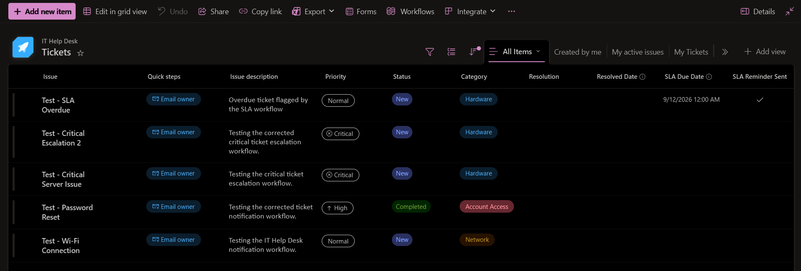
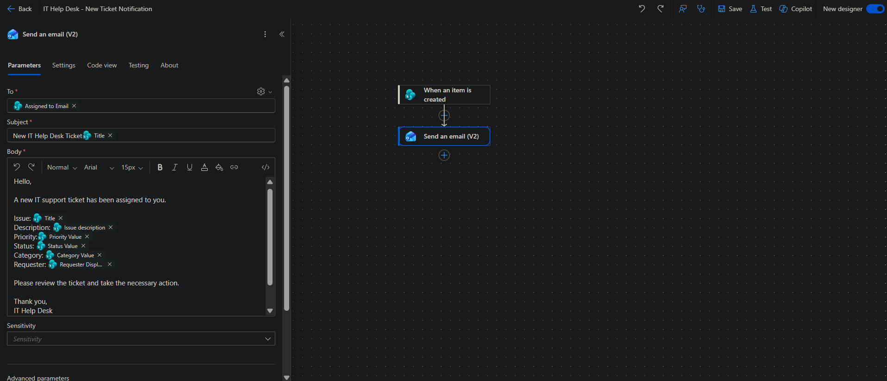
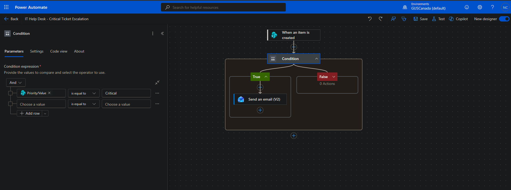
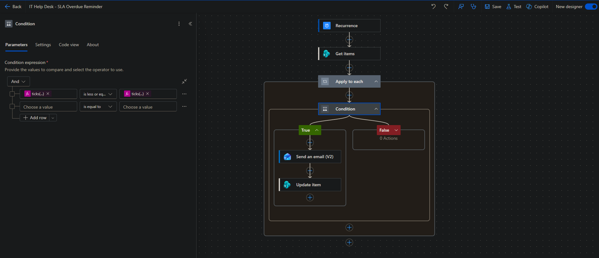
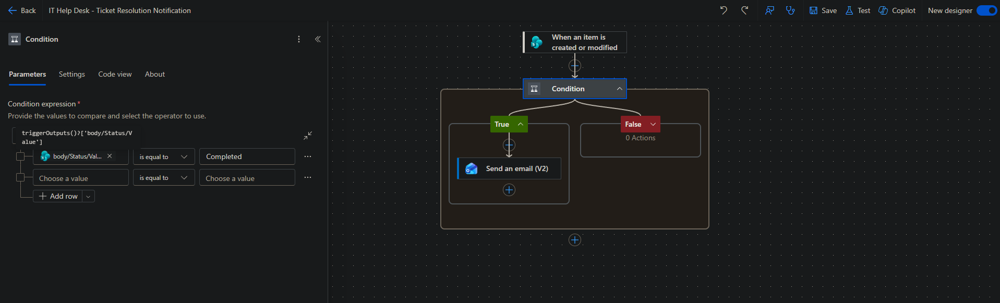
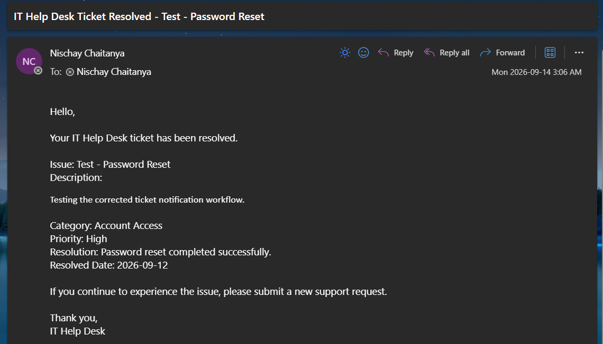

# IT Service Desk Ticket Management & Automation

A Microsoft **Power Automate + SharePoint** solution that automates a realistic IT support workflow from ticket creation through resolution.

I built this project to demonstrate practical workflow automation for an IT service desk, including technician notifications, priority-based escalation, SLA monitoring, and requester communication.

## Architecture

```text
SharePoint Online
      |
      | Tickets list
      v
Power Automate
      |
      +--> New Ticket Notification --> Assigned technician
      |
      +--> Critical Ticket Escalation --> Assigned technician
      |
      +--> SLA Overdue Reminder --> Assigned technician
      |
      +--> Resolution Notification --> Requester
      |
      v
Microsoft Outlook
```

The SharePoint `Tickets` list acts as the system of record. Power Automate handles event-driven and scheduled workflow logic, while Outlook delivers automated notifications.

## What It Does

**1. New Ticket Notification**  
When a ticket is created, the assigned technician receives the ticket details by email.

**2. Critical Ticket Escalation**  
Critical-priority tickets automatically generate a high-importance notification for the assigned technician.

**3. SLA Overdue Reminder**  
An hourly flow identifies unresolved tickets whose SLA deadline has passed, sends a reminder, and records that the reminder has been sent to prevent duplicate notifications.

**4. Ticket Resolution Notification**  
When a ticket reaches `Completed`, the requester receives an automated email containing the resolution details and resolved date.

## Automation Flows

| Flow | Trigger | Result |
|---|---|---|
| New Ticket Notification | Item created | Technician notified |
| Critical Ticket Escalation | Item created | High-importance escalation |
| SLA Overdue Reminder | Every hour | Overdue ticket reminder and state update |
| Ticket Resolution Notification | Item created or modified | Requester receives resolution |

## Screenshots

Screenshots are stored in the [`screenshots/`](screenshots/) directory and provide visual evidence of the SharePoint ticket system, Power Automate workflows, successful runs, and notification results.

### SharePoint Ticket Management



### New Ticket Notification



### Critical Ticket Escalation



### SLA Overdue Automation



### Ticket Resolution



### Resolution Email



## Technical Highlights

- SharePoint OData filtering to exclude blank, completed, and already-reminded SLA records.
- `ticks()` and `utcNow()` for reliable SLA deadline comparison.
- SharePoint Choice-field handling through the runtime structure exposed by the connector.
- Conditional branching for priority and ticket-state logic.
- State tracking with `SLA Reminder Sent` to prevent repeated notifications.
- Power Automate run history used to diagnose connector and data-reference issues.

## Troubleshooting & Lessons Learned

The project required debugging several real implementation issues during development:

- A renamed SharePoint `Title` field initially produced a blank Issue value in email output.
- Choice-field references did not initially behave as expected in the critical-ticket and resolution conditions.
- Blank SLA dates caused a `Null` versus `String` comparison error until invalid records were filtered before processing.
- The resolution flow initially contained an unresolved `?Status.Value` reference. Inspecting the trigger output revealed the correct runtime structure.
- An early resolution email exposed incomplete source data because Resolution and Resolved Date had not been populated on the test ticket.

These issues were diagnosed from Power Automate run history and corrected through runtime inspection, expression changes, data filtering, and retesting.

## Project Structure

```text
it-service-desk-ticket-management/
├── README.md
├── .gitignore
├── screenshots/
└── docs/
    ├── architecture.md
    ├── implementation-journey.md
    ├── power-automate-flows.md
    └── sharepoint-schema.md
```

## Documentation

- [Architecture](docs/architecture.md) — high-level workflow and system design
- [Power Automate Flows](docs/power-automate-flows.md) — detailed workflow implementation
- [Implementation Journey](docs/implementation-journey.md) — troubleshooting and technical reasoning
- [SharePoint Data Model](docs/sharepoint-schema.md) — data model and design rationale

## Privacy

Use synthetic test data and never publish passwords, API keys, authentication tokens, connection references, or private tenant information.
